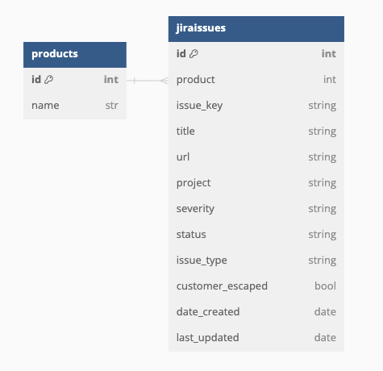

# qe-metrics

Queries Jira and stores results in a database for further analysis in Grafana.

<!-- TODO: Add step-by-step instructions for adding a product to the regular execution of this tool -->

## Configuration

### Credentials

The qe-metrics tool uses a YAML file passed to it using the `--config-file` option as its source of credentials and other
configuration values. The file holds these values for both the database and the Jira server used by the tool.
Here is an example of a configuration file:

```yaml
database:
    host: some.database.com
    user: my-user
    password: p@ssw0rd
    database: qe-metrics
    port: 1234
    provider: postgres
    local: false
    local_filepath: /tmp/my-db.sqlite
jira:
  token: some-token
  server: https://jira-server.com
````

#### Database Credentials and Configuration

- `host`: The FQDN or IP of the database server.
- `user`: The username used to connect to the database.
- `password`: The password used to connect to the database.
- `database`: The name of the database to connect to.

Optional values:

- `port`: The port number of the database service.
  - Default: `5432`.
- `provider`: Database provider. Please see [supported providers](https://ponyorm.readthedocs.io/en/latest/api_reference.html#supported-databases).
  - Default: `postgres`.
- `local`: A boolean value. If "true", a local SQLite database. If "false", the creds above are used.
  - Default: `false`
- `local_filepath`: Optional path to the local SQLite database file.
  - Default: `/tmp/qe_metrics.sqlite`

#### Jira Credentials and Configuration

- `token`: The API token used to authenticate with the Jira server.
- `server`: The FQDN or IP of the Jira server. Must include the protocol (e.g. `https://`).

### Products and Queries

The qe-metrics tool uses a YAML file passed to it using the `--products-file` option as its source of products and queries.
The file should hold a list of defined products, each with a list of Jira queries to be executed. Here is an example of a products file:

```yaml
some_product:
  blocker: "project = 'PRODUCT' AND resolution = Unresolved AND Issuetype = bug AND priority = blocker"
  critical-blocker: "project = 'PRODUCT' AND resolution = Unresolved AND Issuetype = bug AND priority = blocker AND labels = 'critical'"
another_product:
  blocker: "project = 'PRODUCT2' AND resolution = Unresolved AND Issuetype = bug AND priority = blocker"
  critical-blocker: "project = 'PRODUCT2' AND resolution = Unresolved AND Issuetype = bug AND priority = blocker AND labels = 'critical'"
```

The example above defines two "products", `some_product` and `another_product`, each with two queries. The queries have a
"severity" of `blocker` and `critical-blocker`. The queries are written in [Jira Query Language (JQL)](https://support.atlassian.com/jira-software-cloud/docs/use-advanced-search-with-jira-query-language-jql/)
and are used to define which issues should be associated with the `product` and `severity` in the database.

#### Severity

The severity of a query is used to define the severity of the issues returned by the query. Currently, the following
severities are supported:

- `blocker`
- `critical-blocker`


## Database Schema

The supporting database for the tool consists of two tables -- `jiraissues` and `products`.



Because the tool makes use of an [object relational mapper](https://docs.ponyorm.org/), the tables are created by the tool if they are not already present in the database when the tool is executed. If this tool is being used with a new database, it is recommended to allow the tool to create the tables.

<!-- TODO: Add outline of how CI will work -->
